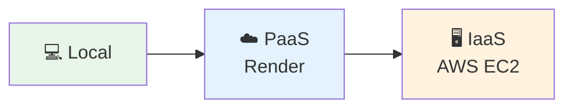
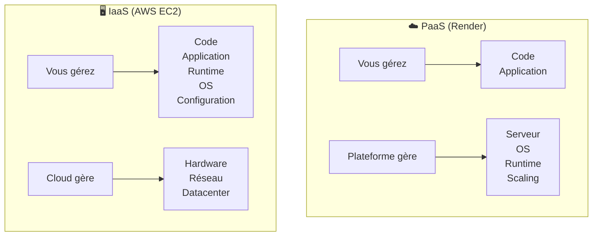

# TD1 - Du Local au Cloud : Déploiement d'Applications

## Introduction

L'objectif de ce TD est d'introduire le déploiement d'applications en passant **progressivement d'un environnement local au cloud**. Vous découvrirez trois approches différentes, chacune avec ses avantages et compromis.



---

## Étape 1 : Exécution locale (Localhost)

La première étape consiste à faire fonctionner l'application sur votre propre ordinateur pour comprendre son fonctionnement de base.

### Structure du projet

```
devops_base/
└── ch1/
    └── sample-app/
        └── app.js
```

### Code de l'application

Créez le fichier `app.js` avec le code suivant :

```javascript
const http = require('http');

const server = http.createServer((req, res) => {
  res.writeHead(200, { 'Content-Type': 'text/plain' });
  res.end('Hello, World!\n');          
});

const port = process.env.PORT || 8080; 
server.listen(port,() => {
  console.log(`Listening on port ${port}`);
});
```

> [!NOTE]
> Ce code crée un serveur HTTP minimaliste qui :
> - Écoute sur le port 8080 (ou celui défini par la variable d'environnement `PORT`)
> - Renvoie "Hello, World!" à chaque requête

### Test en local

```bash
# Lancer l'application
node app.js

# Résultat attendu : "Listening on port 8080"
```

Ouvrez http://localhost:8080 dans votre navigateur pour vérifier que l'application fonctionne.

---

## Étape 2 : Déploiement via PaaS (Platform as a Service)

Le **PaaS** (Platform as a Service) est un modèle cloud où la plateforme gère l'infrastructure pour vous. Vous vous concentrez uniquement sur votre code.

### Pourquoi Render ?

| Avantage | Description |
|----------|-------------|
| 🆓 Gratuit | Offre un tier gratuit suffisant pour les tests |
| 🚀 Simple | Pas de configuration de serveur |
| 🔗 Git native | Déploiement automatique depuis GitHub |

### Processus de déploiement

1. **Créer un compte** sur [render.com](https://render.com)
2. **Nouveau Web Service** → Connecter votre dépôt Git
   - Repo exemple : `https://github.com/BTajini/devops-base`
3. **Configurer** :
   - Build Command : *(laisser vide pour Node.js)*
   - Start Command : `node app.js`
4. **Déployer** → L'URL publique est générée automatiquement

> [!TIP]
> Exemple d'URL générée : `https://sample-app-wsav.onrender.com`

> [!CAUTION]
> **Nettoyage obligatoire** : Supprimez le service Web à la fin du TD pour éviter tout coût potentiel.

### Solutions des Exercices (Section 2)

**1. Exploration du Dashboard Render**
- **Events** : Historique des déploiements (réussis/échoués).
- **Logs** : Sortie standard de l'application (utile pour voir "Listening on port...").
- **Metrics** : Utilisation CPU/RAM (limitée en mode gratuit).
- **Scale** : Permet d'augmenter le nombre d'instances (payant pour l'autoscaling).

### PaaS vs IaaS : Comparaison



---

## Étape 3 : Déploiement via IaaS (AWS EC2)

L'**IaaS** (Infrastructure as a Service) vous donne un accès complet à un serveur virtuel. Vous êtes responsable de toute la configuration.

### 3.1 Sécurité : Configuration IAM

> [!IMPORTANT]
> **Ne jamais utiliser le compte root AWS !** Créez toujours un utilisateur IAM dédié.

1. Accédez à **IAM** dans la console AWS
2. Créez un utilisateur avec des **permissions administratives**
3. Utilisez cet utilisateur pour toutes les opérations

### 3.2 Configuration de l'instance EC2

| Paramètre | Valeur |
|-----------|--------|
| AMI | Amazon Linux 2023 |
| Type | t2.micro (éligible Free Tier) |
| Stockage | 8 Go gp3 (défaut) |

### 3.3 Script User Data

Le **User Data** est un script exécuté automatiquement au premier démarrage de l'instance. Il permet d'automatiser le provisionnement.

```bash
#!/bin/bash
set -euxo pipefail
# Redirection des logs pour le débogage (indispensable en cas d'erreur)
exec > >(tee /var/log/user-data.log | logger -t user-data) 2>&1

# 1. Installation de Node.js (Gestion de la compatibilité Amazon Linux 2 vs 2023)
if grep -qi "Amazon Linux 2" /etc/system-release; then
  yum -y update
  curl -fsSL https://rpm.nodesource.com/setup_20.x | bash -
  yum -y install nodejs
else
  dnf -y update
  curl -fsSL https://rpm.nodesource.com/setup_20.x | bash -
  dnf -y install nodejs
fi

# 2. Création du dossier et de l'application dans /opt (plus propre que le home directory)
mkdir -p /opt/sample-app
cat >/opt/sample-app/app.js <<'EOF'
const http = require('http');
const port = process.env.PORT || 8080;
const server = http.createServer((req,res)=>{
    res.writeHead(200,{'Content-Type':'text/plain'});
    res.end('Hello from EC2 running with Systemd!\n');
});
server.listen(port, '0.0.0.0', () => console.log('Listening on', port));
EOF

# 3. Création du service Systemd (La solution aux problèmes du Lab)
cat >/etc/systemd/system/sample-app.service <<'EOF'
[Unit]
Description=Sample Node app
After=network-online.target
Wants=network-online.target

[Service]
WorkingDirectory=/opt/sample-app
ExecStart=/usr/bin/node /opt/sample-app/app.js
# Redémarrage automatique en cas de crash
Restart=always
# Utilisateur root utilisé ici pour simplifier (comme noté dans ton script)
User=root
Environment=PORT=8080

[Install]
# Permet à l'app de se lancer au démarrage du serveur
WantedBy=multi-user.target
EOF

# 4. Activation et démarrage du service
systemctl daemon-reload
systemctl enable --now sample-app
```

> [!NOTE]
> **Pourquoi Systemd plutôt que `node app.js &` ?**
> - ✅ Redémarrage automatique en cas de crash
> - ✅ Démarrage automatique au boot du serveur
> - ✅ Gestion propre des logs via `journalctl`

### Solutions des Exercices (Section 3)

**1. Persistance au redémarrage (Reboot)**
Si vous avez lancé l'app avec `node app.js &` (méthode naïve), elle **ne redémarrera pas** après un reboot du serveur.
Avec le service **Systemd** configuré ci-dessus (`systemctl enable sample-app`), l'application redémarre automatiquement. C'est la différence entre un "bricolage" et une installation production-ready.

**2. Monitoring CloudWatch**
Dans la console AWS, cherchez **CloudWatch**.
- **Metrics** : Sélectionnez EC2 > Per-Instance Metrics pour voir CPU, Network in/out.
- **Logs** : Par défaut, les logs applicatifs ne remontent PAS dans CloudWatch (nécessite l'agent CloudWatch). Seuls les métriques d'infrastructure sont visibles.

---

## Problèmes rencontrés et solutions

### 1. Port 80 vs Port 8080 : Ports privilégiés Linux

> [!CAUTION]
> **Le port 80 ne fonctionnait pas !** L'application refusait de démarrer ou crashait silencieusement.

**Explication** : Sous Linux, les ports **inférieurs à 1024** sont des **ports privilégiés** (*privileged ports*). Seul l'utilisateur `root` peut ouvrir un socket sur ces ports.

**Solution** : Utiliser le **port 8080** (ou tout port > 1024) :

```bash
Environment=PORT=8080
```

> [!TIP]
> Pour utiliser le port 80, configurez une redirection avec `iptables` :
> ```bash
> sudo iptables -t nat -A PREROUTING -p tcp --dport 80 -j REDIRECT --to-port 8080
> ```

---

### 2. Blocage réseau ESIEE Paris

> [!WARNING]
> La page moulinait indéfiniment sans jamais afficher de réponse.

**Symptôme** : Les requêtes HTTP vers l'instance EC2 n'aboutissaient pas depuis le réseau ESIEE.

**Cause** : Le pare-feu du réseau ESIEE bloque certains ports ou filtre le trafic vers AWS.

**Solution** : 
- Utiliser un **réseau alternatif** (partage de connexion 4G/5G)
- Ou configurer un **VPN**

---

### 3. Configuration des Security Groups AWS

> [!IMPORTANT]
> Sans la bonne configuration du Security Group, l'instance est inaccessible !

#### Règles entrantes (Inbound Rules)

| Type | Protocole | Port | Source | Description |
|------|-----------|------|--------|-------------|
| SSH | TCP | 22 | 0.0.0.0/0 | Accès console CLI |
| Custom TCP | TCP | 8080 | 0.0.0.0/0 | Application Node.js |

#### Règles sortantes (Outbound Rules)

| Type | Protocole | Port | Destination | Description |
|------|-----------|------|-------------|-------------|
| All traffic | All | All | 0.0.0.0/0 | Accès Internet (packages, APIs) |

---

## Limitations du User Data (pour la production)

> [!WARNING]
> Ces limitations seront résolues dans les TDs suivants.

| Limitation | Impact | Solution (TDs futurs) |
|------------|--------|----------------------|
| Exécution en root | Risque de sécurité | Utilisateur dédié |
| Pas de supervision | Pas d'alertes en cas de problème | Monitoring (CloudWatch) |
| Configuration manuelle | Non reproductible | Infrastructure as Code (Terraform) |
| Pas de CI/CD | Déploiements manuels | Pipelines automatisés |

---

## Résultat attendu

Après le déploiement EC2, l'application est accessible sur :

```
http://<IP_PUBLIQUE>:8080
```

Réponse : **"Hello from EC2 running with Systemd!"**

---

## Nettoyage obligatoire

> [!CAUTION]
> **Terminez votre instance EC2** après le TD pour éviter des frais !
> 
> Console EC2 → Sélectionner l'instance → Actions → Instance State → **Terminate**

---

## Résumé

Ce TD vous a fait voyager du développement local vers le cloud :

| Étape | Environnement | Responsabilité |
|-------|---------------|----------------|
| 1️⃣ | Local (localhost) | Tout sur votre machine |
| 2️⃣ | PaaS (Render) | Vous gérez le code, la plateforme gère le reste |
| 3️⃣ | IaaS (AWS EC2) | Vous gérez tout sauf le hardware |
