# TD2 - Infrastructure as Code (IaC)

## Introduction

Ce second laboratoire se concentre sur l'**Infrastructure as Code (IaC)**. L'objectif est d'automatiser le déploiement et la configuration de l'infrastructure pour la rendre plus rapide, cohérente et moins sujette aux erreurs humaines.

```mermaid
flowchart LR
    A[📝 Scripts Bash<br/>Ad Hoc] --> B[⚙️ Ansible<br/>Configuration]
    B --> C[📦 Packer<br/>Images AMI]
    C --> D[🏗️ OpenTofu<br/>Provisioning]
    
    style A fill:#ffebee
    style B fill:#e8f5e9
    style C fill:#e3f2fd
    style D fill:#fff3e0
```



> [!TIP]
> **Pourquoi `us-east-1` ?**
> C'est la région AWS avec les **tarifs les plus bas**. Cela permet une utilisation plus longue du Free Tier et réduit les coûts en cas de dépassement.

---

## Prérequis : Authentification AWS

Avant toute automatisation, vous devez configurer l'accès programmatique à AWS.

### Création des clés d'accès

1. Accédez à **IAM → Users → Security credentials**
2. Créez une nouvelle **Access Key**
3. Notez l'**Access Key ID** et le **Secret Access Key**

### Configuration des variables d'environnement

```bash
export AWS_ACCESS_KEY_ID="AKIA..."
export AWS_SECRET_ACCESS_KEY="votre-secret-key"
export AWS_DEFAULT_REGION="us-east-1"
```

> [!CAUTION]
> **Ne commitez jamais vos clés AWS dans Git !** Utilisez des variables d'environnement ou AWS Secrets Manager.

---

## Étape 1 : Scripts Ad Hoc (Bash)

La première approche d'automatisation est "brute" : un script Bash qui utilise l'AWS CLI.

### Script de déploiement

```bash
#!/usr/bin/env bash
set -e

# 1. Setup Variables
export AWS_DEFAULT_REGION="us-east-1"
SCRIPT_DIR="$(cd "$(dirname "${BASH_SOURCE[0]}")" && pwd)"
# Ensure user-data exists before catting it to avoid errors
if [ -f "$SCRIPT_DIR/user-data.sh" ]; then
    user_data=$(cat "$SCRIPT_DIR/user-data.sh")
else
    echo "Error: user-data.sh not found."
    exit 1
fi

# 2. Create Security Group
echo "Creating Security Group..."
security_group_id=$(aws ec2 create-security-group \
  --group-name "sample-app-$(date +%s)" \
  --description "Allow HTTP traffic into the sample app" \
  --output text \
  --query GroupId)

# 3. Authorize Traffic
echo "Authorizing Ingress..."
aws ec2 authorize-security-group-ingress \
  --group-id "$security_group_id" \
  --protocol tcp \
  --port 8080 \
  --cidr "0.0.0.0/0" > /dev/null

# 4. Launch Instance
echo "Launching Instance..."
instance_id=$(aws ec2 run-instances \
  --image-id "ami-0fa3fe0fa7920f68e" \
  --instance-type "t3.micro" \
  --security-group-ids "$security_group_id" \
  --user-data "$user_data" \
  --tag-specifications 'ResourceType=instance,Tags=[{Key=Name,Value=sample-app}]' \
  --output text \
  --query Instances[0].InstanceId)

# 5. WAIT for the instance to run (From Script 2 - Crucial Step)
echo "Waiting for instance $instance_id to be running..."
aws ec2 wait instance-running --instance-ids "$instance_id"

# 6. Get Public IP
public_ip=$(aws ec2 describe-instances \
  --instance-ids "$instance_id" \
  --output text \
  --query 'Reservations[*].Instances[*].PublicIpAddress')

# 7. Output
echo "--------------------------------"
echo "Instance ID       = $instance_id"
echo "Security Group ID = $security_group_id"
echo "Public IP         = $public_ip"
echo "--------------------------------"
```

### Limites des scripts Bash

| Limitation | Impact |
|------------|--------|
| Approche **impérative** | Chaque étape doit être définie manuellement |
| Pas d'**idempotence** | Relancer le script peut créer des doublons |
| Gestion d'erreurs complexe | Difficile à maintenir |
| Pas d'état | Impossible de savoir ce qui est déjà déployé |

### Solutions des Exercices (Section 1)

**1. User-data et Bootstrap**
Le script `user-data.sh` est passé à l'instance au démarrage pour installer l'application automatiquement.
```bash
export AWS_DEFAULT_REGION="us-east-1"
user_data=$(cat "$SCRIPT_DIR/user-data.sh")
```

**2. Récupération de l'IP publique**
Après le `wait instance-running`, on utilise `describe-instances` avec une query JMESPath.

**3. Idempotence (Exercice)**
Si vous relancez le script ("What happens if you run the script a second time?"), une **nouvelle instance** et un **nouveau Security Group** seront créés (souvent avec une erreur pour le SG s'il a le même nom).
Ce script n'est **pas idempotent**. Il ne vérifie pas l'état existant avant d'agir.

**4. Déployer plusieurs instances (Exercice)**
Pour déployer plusieurs instances, il faudrait ajouter une boucle `for` dans le script Bash :
```bash
for i in {1..3}; do
  ./deploy-ec2-instance.sh
done
```
C'est laborieux et difficile à gérer (3 outputs différents, pas de lien entre eux).

---

## Étape 2 : Gestion de Configuration (Ansible)

Ansible est un outil de **gestion de configuration** qui utilise une approche déclarative.

### Playbook de création d'instance

```yaml
- name: Deploy an EC2 instance in AWS
  hosts: localhost
  gather_facts: no
  environment:
    AWS_REGION: us-east-1
  tasks:    
    - name: Create security group                      
      amazon.aws.ec2_security_group:
        name: sample-app-ansible 
        description: Allow HTTP and SSH traffic
        rules:
          - proto: tcp
            ports: [8080]
            cidr_ip: 0.0.0.0/0
          - proto: tcp
            ports: [22]
            cidr_ip: 0.0.0.0/0
      register: aws_security_group

    - name: Create a new EC2 key pair                  
      amazon.aws.ec2_key:
        name: ansible-ch2
        file_name: ansible-ch2.key                     
      no_log: true
      register: aws_ec2_key_pair

    - name: Create EC2 instance with Amazon Linux 2023 
      amazon.aws.ec2_instance:
        name: sample-app-ansible
        key_name: "{{ aws_ec2_key_pair.key.name }}"
        instance_type: t3.micro
        security_group: "{{ aws_security_group.group_id }}"
        image_id: ami-0fa3fe0fa7920f68e
        tags:
          Ansible: ch2_instances                       
```

### Playbook de configuration

```yaml
- name: Configure the EC2 instance to run a sample app
  hosts: ch2_instances 
  gather_facts: true
  become: true
  roles:
    - sample-app       
```

### Rôle sample-app (tasks/main.yml)

```yaml
- name: Add Node packages to yum  
  shell: curl -fsSL https://rpm.nodesource.com/setup_21.x | bash -

- name: Install Node.js
  yum:
    name: nodejs

- name: Copy sample app           
  copy:
    src: app.js
    dest: app.js

- name: Start sample app          
  shell: nohup node app.js &
```

### Concepts Ansible clés

| Concept | Description |
|---------|-------------|
| **Playbook** | Fichier YAML décrivant les tâches à exécuter |
| **Inventory** | Liste des serveurs cibles |
| **Role** | Ensemble de tâches réutilisables |
| **Become** | Élévation de privilèges (sudo) |

### Solutions des Exercices (Section 2)

**1. Inventaire Dynamique (`inventory.aws_ec2.yml`)**
Pour découvrir automatiquement les instances EC2 via leurs tags.

**2. Idempotence (Exercice)**
Si vous relancez le playbook ("What happens if you run the configuration playbook a second time?"), Ansible détectera que l'état souhaité est déjà atteint (Node.js installé, fichier copié). Il ne fera **rien** (`changed=0`). C'est la force de l'idempotence.

**3. Déployer plusieurs instances (Exercice)**
Il suffit de modifier le playbook de création pour demander plusieurs instances (module `amazon.aws.ec2_instance`, paramètre `count: 3` ou une boucle), ou simplement changer les tags dans l'inventaire pour cibler plus de machines existantes.

---

## Étape 3 : Templating de Serveur (Packer)

Au lieu d'installer l'application à chaque démarrage (lent), **Packer** crée une image "pré-cuite" (AMI).

### Template Packer (HCL)

```hcl
packer {
  required_plugins {
    amazon = {
      version = ">= 1.3.1"
      source  = "github.com/hashicorp/amazon"
    }
  }
}

source "amazon-ebs" "amazon_linux" {                  
  ami_name        = "sample-app-packer-${uuidv4()}"
  ami_description = "Amazon Linux 2023 AMI with a Node.js sample app."
  instance_type   = "t3.micro"
  region          = "us-east-1"
  source_ami      = "ami-0fa3fe0fa7920f68e"
  ssh_username    = "ec2-user"
}

build {                                               
  sources = ["source.amazon-ebs.amazon_linux"]

  provisioner "file" {                                
    source      = "app.js"
    destination = "/home/ec2-user/app.js"
  }

  provisioner "shell" {                               
    inline = [
      "curl -fsSL https://rpm.nodesource.com/setup_21.x | sudo bash -",
      "sudo yum install -y nodejs"
    ]
    pause_before = "30s"
  }
}
```

### Processus Packer


### Commandes Packer

```bash
# Initialiser les plugins
packer init sample-app.pkr.hcl

# Valider le template
packer validate sample-app.pkr.hcl

# Construire l'AMI
packer build sample-app.pkr.hcl
```

### Solutions des Exercices (Section 3)

**1. Provisioners Packer**
Le `file` provisioner copie l'application, puis le `shell` provisioner installe Node.js.

**2. Pause avant exécution**
Le `pause_before = "30s"` attend que l'instance soit complètement initialisée avant d'exécuter les commandes.

**3. Re-build (Exercice)**
Si vous relancez `packer build`, une **nouvelle AMI** sera créée avec un nouvel ID unique. Les anciennes AMIs restent disponibles (et coûtent de l'argent) jusqu'à ce que vous les supprimiez.

**4. Multi-provider (Exercice)**
Packer supporte d'autres builders comme VirtualBox, Azure, ou Google Cloud. Vous pouvez ajouter un bloc `source "azure-arm" "..."` et un build correspondant pour générer une image pour Azure avec le **même** provisionning.

---

## Étape 4 : Provisioning avec OpenTofu

**OpenTofu** (fork open-source de Terraform) permet de gérer le cycle de vie complet de l'infrastructure.

### Configuration principale (main.tf)

```hcl
provider "aws" {                                               
  region = "us-east-1"
}

resource "aws_security_group" "sample_app" {                   
  name        = "sample-app-tofu-2"
  description = "Allow HTTP traffic into the sample app"
}

resource "aws_security_group_rule" "allow_http_inbound" {      
  type              = "ingress"
  protocol          = "tcp"
  from_port         = 8080
  to_port           = 8080
  security_group_id = aws_security_group.sample_app.id
  cidr_blocks       = ["0.0.0.0/0"]
}

resource "aws_security_group_rule" "allow_all_outbound" {
  type              = "egress"
  protocol          = "-1"       # -1 signifie "tous les protocoles"
  from_port         = 0
  to_port           = 0
  security_group_id = aws_security_group.sample_app.id
  cidr_blocks       = ["0.0.0.0/0"]
}

resource "aws_security_group_rule" "allow_ssh_inbound" {
  type              = "ingress"
  protocol          = "tcp"
  from_port         = 22
  to_port           = 22
  security_group_id = aws_security_group.sample_app.id
  cidr_blocks       = ["0.0.0.0/0"]
}

resource "aws_instance" "sample_app" {
  ami                    = var.ami_id
  instance_type          = "t3.micro"
  vpc_security_group_ids = [aws_security_group.sample_app.id]
  user_data              = file("${path.module}/user-data.sh")

  # Clé SSH pour accès à l'instance
  key_name               = "ansible-ch2"

  tags = {
    Name = "sample-app-tofu"
  }
}
```

### Cycle de vie OpenTofu

```bash
# 1. Initialiser le projet
tofu init

# 2. Prévisualiser les changements
tofu plan

# 3. Appliquer les changements
tofu apply

# 4. Détruire l'infrastructure
tofu destroy
```

### Module réutilisable

Pour organiser le code, on peut créer des **modules** réutilisables :

```hcl
# modules/ec2-instance/main.tf
resource "aws_security_group" "sample_app" {
  name        = var.name
  description = "Allow HTTP traffic into ${var.name}"
}

resource "aws_security_group_rule" "allow_http_inbound" {
  type              = "ingress"
  protocol          = "tcp"
  from_port         = var.http_port
  to_port           = var.http_port
  security_group_id = aws_security_group.sample_app.id
  cidr_blocks       = ["0.0.0.0/0"]
}

resource "aws_instance" "sample_app" {
  ami                    = var.ami_id
  instance_type          = var.instance_type
  key_name               = var.key_name
  vpc_security_group_ids = [aws_security_group.sample_app.id]

  user_data = templatefile("${path.module}/user-data.sh", {
    http_port = var.http_port
  })

  tags = {
    Name = var.name
  }
}
```

### Appel d'un module

```hcl
# live/sample-app/main.tf
module "sample_app" {
  source        = "../../modules/ec2-instance"
  
  name          = "sample-app-prod"
  ami_id        = "ami-xxxxx"
  instance_type = "t3.micro"
  http_port     = 8080
  key_name      = "my-key"
}
```

### Solutions des Exercices (Section 4)

**1. Module réutilisable**
Le module `ec2-instance` encapsule Security Group + Instance + user-data via `templatefile()`.

**2. Apply après Destroy (Exercice)**
Si vous lancez `tofu apply` après un `destroy`, Tofu recréera toutes les ressources à l'identique.

**3. Déployer plusieurs instances (Exercice)**
Utilisez `count` ou `for_each` dans la ressource ou le module :
```hcl
module "sample_app" {
  count         = 3
  source        = "../../modules/ec2-instance"
  name          = "sample-app-${count.index}"
  # ...
}
```

**4. Modules GitHub (Section 7)**
Vous pouvez sourcer un module directement depuis GitHub :
```hcl
module "vpc" {
  source = "github.com/terraform-aws-modules/terraform-aws-vpc"
  # ...
}
```

---

## Comparaison des outils

| Outil | Type | Approche | Usage |
|-------|------|----------|-------|
| **Bash/AWS CLI** | Scripts | Impérative | Prototypage rapide |
| **Ansible** | Configuration | Déclarative | Configuration de serveurs |
| **Packer** | Image Builder | Déclarative | Création d'AMIs |
| **OpenTofu** | Provisioning | Déclarative | Gestion du cycle de vie |

```mermaid
graph TB
    subgraph "Infrastructure as Code"
        P[Packer] -->|Crée| AMI[AMI personnalisée]
        AMI -->|Utilisée par| T[OpenTofu]
        T -->|Provisionne| EC2[Instance EC2]
        A[Ansible] -->|Configure| EC2
    end
```



---

## Nettoyage obligatoire

> [!CAUTION]
> **Supprimez toutes les ressources AWS après le TD pour éviter les frais !**

```bash
# OpenTofu : détruire toute l'infrastructure
tofu destroy

# Vérifier dans la console AWS :
# - Instances EC2
# - Security Groups
# - AMIs Packer
# - Clés SSH
```

---

## Résumé

Ce TD vous a fait progresser de scripts manuels vers une approche professionnelle d'IaC :

| Étape | Outil | Apprentissage |
|-------|-------|---------------|
| 1️⃣ | Bash/AWS CLI | Scripts impératifs et leurs limites |
| 2️⃣ | Ansible | Configuration déclarative avec Playbooks et Roles |
| 3️⃣ | Packer | Création d'images AMI pré-configurées |
| 4️⃣ | OpenTofu | Provisioning et gestion du cycle de vie |
