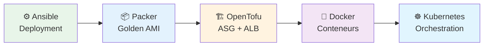

# TD3 - Orchestration et Conteneurisation

## Introduction

Ce troisième laboratoire marque une étape majeure : le passage de scripts individuels à une véritable **orchestration d'infrastructure** et à la **conteneurisation**. Nous allons explorer comment gérer des applications à l'échelle en utilisant des outils modernes comme Ansible (avec rôles avancés), OpenTofu (avec modules), Docker et Kubernetes.



---

## Étape 1 : Ansible avancé (Boucles et Prompts)

Nous améliorons notre utilisation d'Ansible pour déployer plusieurs instances dynamiquement.

### Playbook interactif (`create_ec2_instances_playbook.yml`)

Ce playbook demande à l'utilisateur combien d'instances créer et déploie l'infrastructure correspondante.

```yaml
- name: Deploy EC2 instances in AWS
  hosts: localhost
  gather_facts: no
  vars_prompt:                                                
    - name: num_instances
      prompt: How many instances to create?
      private: false
    - name: base_name
      prompt: What to use as the base name for resources?
      private: false
  tasks:
    # Création dynamique des instances avec une boucle
    - name: Create EC2 instances with Amazon Linux 2023 AMI
      loop: "{{ range(num_instances | int) | list }}"         
      amazon.aws.ec2_instance:
        name: "{{ '%s-%d' | format(base_name, item) }}"       
        key_name: "{{ aws_ec2_key_pair.key.name }}"
        instance_type: t3.micro
        security_group: "{{ aws_security_group.group_id }}"
        image_id: ami-0fa3fe0fa7920f68e
```

### Solutions des Exercices (Section 1)

**1. Inventaire Dynamique (`inventory.aws_ec2.yml`)**
Au lieu de lister les IP manuellement, nous utilisons le plugin `aws_ec2` pour découvrir les instances via leurs tags.
```yaml
plugin: amazon.aws.aws_ec2
regions:
  - us-east-1
keyed_groups:
  - key: tags.Ansible
    prefix: ""
```

**2. Load Balancer Nginx**
Pour répartir la charge, nous avons configuré une instance Nginx avec un playbook dédié (`configure_nginx_playbook.yml`) qui utilise le rôle `nginx`.
Ce rôle génère dynamiquement la configuration `nginx.conf` en listant les IPs des serveurs d'application (récupérées via les "facts" Ansible).

**3. Rolling Update avec Ansible**
Pour mettre à jour sans interruption, nous ajoutons `serial: 1` dans le playbook. Ansible mettra à jour les instances une par une.
*Vérification* : Pendant que le playbook tourne, lancez une boucle `while true; do curl http://<IP>; sleep 0.5; done` pour voir la réponse changer sans erreur 500.

---

## Étape 2 : Packer et Golden Images

Plutôt que d'installer l'application au démarrage, nous créons une **Golden Image** (AMI) pré-configurée optimisée pour la production avec `pm2`.

### Template Packer (`sample-app.pkr.hcl`)

```hcl
packer {
  required_plugins {
    amazon = {
      source  = "github.com/hashicorp/amazon"
      version = ">= 1.3.1"
    }
  }
}

source "amazon-ebs" "amazon_linux" {
  ami_name        = "sample-app-packer-${uuidv4()}"
  instance_type   = "t3.micro"
  region          = "us-east-1"
  source_ami      = "ami-0fa3fe0fa7920f68e"
  ssh_username    = "ec2-user"
}

build {
  sources = ["source.amazon-ebs.amazon_linux"]

  provisioner "shell" {
    inline = [
      "curl -fsSL https://rpm.nodesource.com/setup_21.x | sudo bash -",
      "sudo yum install -y nodejs",
      "sudo npm install pm2@latest -g",                                  
      "eval \"$(sudo su app-user bash -c 'pm2 startup' | tail -n1)\""    
    ]
  }
}
```

> [!TIP]
> **PM2** est un gestionnaire de processus de production pour Node.js. Il gère le redémarrage automatique, les logs et le monitoring.

---

## Étape 3 : OpenTofu avec Auto Scaling Group (ASG)

Nous utilisons OpenTofu pour déployer une architecture haute disponibilité avec un **Load Balancer (ALB)** et un **Auto Scaling Group (ASG)**.

### Architecture (`main.tf`)

```hcl
module "asg" {
  source = "../../modules/asg"

  name = "sample-app-asg"                                   
  ami_id = "ami-008eba0ec68324b1d" # À remplacer par votre AMI Packer
  
  min_size         = 1                                      
  max_size         = 10                                     
  desired_capacity = 3                                      

  target_group_arns = [module.alb.target_group_arn]
}

module "alb" {
  source = "../../modules/alb"
  name   = "sample-app-alb" 
}
```

Cette configuration assure que :
1. Il y a toujours au moins 1 instance (max 10, souhaité 3)
2. Si une instance crash, l'ASG la remplace
3. L'ALB distribue le trafic entre les instances saines

3. L'ALB distribue le trafic entre les instances saines

### Solutions des Exercices (Section 2)

**1. Instance Refresh (Zero Downtime)**
Pour mettre à jour les instances (ex: nouvelle AMI) sans couper le service, nous avons configuré le bloc `instance_refresh` dans `main.tf` :
```hcl
instance_refresh = {
  strategy = "Rolling"
  preferences = {
    min_healthy_percentage = 50
  }
}
```
Cela force l'ASG à remplacer les instances par vagues, en gardant au moins 50% de capacité saine.

**2. Workflow de Mise à jour (App -> Packer -> Tofu)**
Le cycle complet pour une mise à jour d'application est :
1.  Modifier le code (`app.js`).
2.  Reconstruire l'AMI (`packer build ...`).
3.  Mettre à jour l'ID de l'AMI dans `main.tf` (ou via variable).
4.  Appliquer les changements (`tofu apply`).
5.  L'ASG détecte le changement de Launch Template et lance l'Instance Refresh.

---

## Étape 4 : Conteneurisation (Docker)

Nous passons des machines virtuelles (VM) aux conteneurs légers.

### Dockerfile

```dockerfile
FROM node:21.7

WORKDIR /home/node/app
COPY app.js .
EXPOSE 8080
USER node
CMD ["node", "app.js"]
```

Avantages :
- **Léger** : Pas d'OS complet à démarrer
- **Portable** : Fonctionne partout (local, serveur, cloud)
- **Rapide** : Démarrage en millisecondes

---

## Étape 5 : Orchestration Kubernetes

Pour gérer nos conteneurs en production, nous utilisons Kubernetes.

### Déploiement (`sample-app-deployment.yml`)

```yaml
apiVersion: apps/v1
kind: Deployment                  
metadata:                         
  name: sample-app-deployment
spec:
  replicas: 3                     
  selector:                       
    matchLabels:
      app: sample-app-pods
  template:                       
    metadata:                     
      labels:
        app: sample-app-pods
    spec:
      containers:                 
        - name: sample-app        
          image: sample-app:v1    
          ports:
            - containerPort: 8080 
```

> [!NOTE]
> Kubernetes gère automatiquement la santé des pods (`replicas: 3` garantit 3 instances) et permet des **Rolling Updates** sans interruption de service.

> Kubernetes gère automatiquement la santé des pods (`replicas: 3` garantit 3 instances) et permet des **Rolling Updates** sans interruption de service.

### Solutions des Exercices (Section 3)

**1. Contexte Kubernetes (Local vs Cloud)**
Si `kubectl` ne voit pas vos pods, vérifiez le contexte :
```bash
# Local (Docker Desktop)
kubectl config use-context docker-desktop
# Cloud (EKS)
kubectl config use-context arn:aws:eks:us-east-2:XXXX:cluster/eks-sample
```

**2. Déploiement sur EKS (Bonus)**
Le code pour déployer un cluster EKS complet est disponible dans `scripts/tofu/live/eks-sample`.
Attention : Cela coûte environ $0.10/heure. N'oubliez pas de `tofu destroy` à la fin !
*Vérification* : `kubectl get nodes` doit afficher les nœuds EC2 gérés par EKS.

---

## Étape 6 : Serverless avec AWS Lambda

L'approche **Serverless** permet d'exécuter du code sans gérer aucun serveur. AWS Lambda exécute votre fonction uniquement lorsqu'elle est sollicitée.

### Code de la fonction (`src/index.js`)

```javascript
exports.handler = async (event) => {
    const response = {
        statusCode: 200,
        body: JSON.stringify('Hello from Lambda!'),
    };
    return response;
};
```

### Infrastructure (`main.tf`)

Nous utilisons OpenTofu pour déployer la Lambda et une API Gateway pour la rendre accessible via HTTP.

```hcl
module "lambda" {
  source = "../../modules/lambda"

  name    = "sample-app-lambda"
  src_dir = "${path.module}/src"
  runtime = "nodejs20.x"
  handler = "index.handler"
}

module "api_gateway" {
  source = "../../modules/api-gateway"

  name         = "sample-app-api"
  function_arn = module.lambda.function_arn
}
```

### Solutions des Exercices (Section 4 - Lambda)

**1. Changer de Runtime**
Pour utiliser Python par exemple, il suffit de changer le code (`index.py`) et la variable `runtime = "python3.9"` dans la configuration OpenTofu. Le module gérera le packaging du nouveau code.

**2. Ajouter des routes**
L'API Gateway peut gérer plusieurs routes (ex: `/users`, `/products`). Dans OpenTofu, cela se configure via la variable `routes` du module API Gateway, qui créera les ressources `aws_api_gateway_resource` et `aws_api_gateway_method` correspondantes.

**3. Gestion d'erreurs**
Si la fonction Lambda échoue (ex: `throw new Error("Oups")`), l'API Gateway renverra un code 502 (Bad Gateway). Pour gérer les erreurs proprement, le code doit `catch` les exceptions et retourner un objet avec `statusCode: 400` ou `500` et un body JSON explicite.

---

## 🔴 Problèmes rencontrés et Solutions

Ce lab présente une complexité accrue. Voici les problèmes critiques identifiés et comment les résoudre.

### 1. Clé SSH Manquante (Ansible)

> [!CAUTION]
> **Erreur** : `no such identity: ansible-ch3.key: No such file or directory`

**Cause** : La clé existe dans AWS mais le fichier local `.key` a été perdu.
**Solution** :
1. Supprimer la clé AWS : `aws ec2 delete-key-pair --key-name ansible-ch3`
2. Recréer et sauvegarder : 
   ```bash
   aws ec2 create-key-pair --key-name ansible-ch3 --query 'KeyMaterial' --output text > ansible-ch3.key
   chmod 400 ansible-ch3.key
   ```

### 2. AMI ID Hardcodée (OpenTofu)

> [!WARNING]
> **Erreur** : `The image ID 'None' is not valid` lors du `tofu apply`.

**Cause** : Le script ne trouve pas l'AMI générée par Packer car le filtre de nom est incorrect ou l'AMI n'existe pas.
**Solution** :
- Vérifiez que Packer a bien terminé sa construction (`packer build ...`).
- Assurez-vous que l'ID de l'AMI dans `main.tf` correspond à celle générée (ou utilisez une data source pour la récupérer dynamiquement).

### 3. Conflit de Contexte Kubernetes (Docker vs EKS)

> [!IMPORTANT]
> **Erreur** : `kubectl` ne voit pas vos pods ou le déploiement échoue.

**Cause** : `kubectl` pointe vers le mauvais cluster (Docker Desktop local au lieu d'AWS EKS, ou inversement).
**Solution** : Vérifiez et changez le contexte :
```bash
# Voir le contexte actuel
kubectl config current-context

# Passer à Docker Desktop (local)
kubectl config use-context docker-desktop

# Passer à AWS EKS (cloud)
aws eks update-kubeconfig --name <cluster-name>
```

### 4. Coûts AWS (EKS)

> [!CAUTION]
> **EKS n'est PAS inclus dans le Free Tier !** (~$0.10/heure par cluster).

**Action impérative** : Détruisez le cluster EKS dès que vous avez fini le test.
```bash
tofu destroy
```

### 5. Inventaire Dynamique Ansible

**Problème** : L'inventaire ne détectait pas les IP publiques des nouvelles instances.
**Solution** : Dans `inventory.aws_ec2.yml`, utiliser `dns-name` et `ip-address` au lieu de l'option obsolète `public-ip-address`.

---

## Conclusion

Ce TD3 nous a fait traverser l'évolution moderne du DevOps :
1. **VMs classiques** gérées par Ansible (Scripting avancé)
2. **Immutable Infrastructure** avec Packer (Images fixes)
3. **Infrastructure élastique** avec OpenTofu (ASG/ALB)
4. **Conteneurs** avec Docker (Portabilité)
5. **Orchestration** avec Kubernetes (Gestion à l'échelle)

Cette stack complète représente l'état de l'art pour déployer des applications résilientes et scalables.
