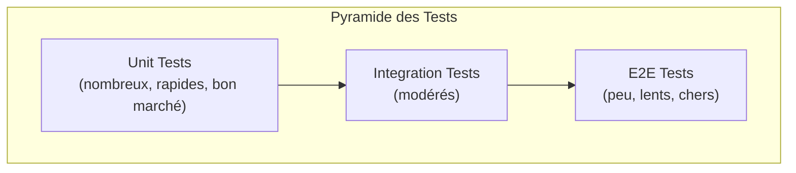

# TD4 - Git, CI/CD & Serverless

## Introduction

Ce quatrième laboratoire couvre l'ensemble du cycle de vie DevOps, depuis la gestion du code source jusqu'au déploiement serverless, en passant par la conteneurisation et les tests automatisés.

**Objectifs :**
1. Maîtriser le **Versioning** (Git/GitHub).
2. Automatiser le **Build** (NPM, Docker).
3. Assurer la **Qualité** (Tests Jest).
4. Déployer en **Serverless** (OpenTofu + Lambda).

---

## Partie 1 : Versioning avec Git & GitHub
*(Correspond à la Section 1 & 2 des instructions)*

### Fondamentaux Git 
Nous avons commencé par initialiser un dépôt Git local et manipuler les bases :
- `git init`, `git add`, `git commit`.
- Gestion des **branches** et fusion (`merge`).
- Gestion des conflits.

### Collaboration GitHub
- Création d'un repo distant et connexion (`git remote add origin ...`).
- Flux de travail avec **Pull Requests (PR)** pour la revue de code.
- Utilisation de `.gitignore` pour exclure les fichiers inutiles (node_modules, .env, etc.).

### Solutions des Exercices (Section 1 & 2)

**1. Créer un tag v1.0**
```bash
git tag v1.0
git push origin v1.0
```

**2. Rebase vs Merge**
Le `rebase` réécrit l'historique pour le rendre linéaire (met vos changements *après* ceux de la branche cible), alors que le `merge` crée un commit de fusion qui préserve l'historique des deux branches.

**3. Branch Protection Rules**
Sur GitHub > Settings > Branches > Add rule : Cocher "Require a pull request before merging" pour empêcher les push directs sur `main`.

**4. Signed Commits (Bonus)**
Pour activer les commits signés : `git config --global commit.gpgsign true`. Cela ajoute une couche de sécurité cryptographique prouvant l'identité de l'auteur.

---

## Partie 2 : Build System & Docker
*(Correspond à la Section 3 & 4 des instructions)*

Nous avons transformé une simple application Node.js en un artefact déployable.

### Scripts NPM (`package.json`)
Nous avons automatisé les tâches courantes via des scripts NPM.

```json
/* Fichier : package.json */
{
  "scripts": {
    "start": "node server.js",
    "test": "jest --verbose",
    "dockerize": "./build-docker-image.sh"
  },
  "dependencies": {
    "express": "^4.18.2"
  }
}
```

### Script de Build (`build-docker-image.sh`)
Un script Bash pour automatiser la construction de l'image Docker en utilisant le nom et la version du package.

```bash
#!/bin/bash
PACKAGE_NAME=$(grep -o '"name": "[^"]*' package.json | grep -o '[^"]*$')
PACKAGE_VERSION=$(grep -o '"version": "[^"]*' package.json | grep -o '[^"]*$')
docker build -t "$PACKAGE_NAME:$PACKAGE_VERSION" .
```

### Conteneurisation (`Dockerfile`)
Création d'un `Dockerfile` optimisé pour la production.

```dockerfile
# Fichier : Dockerfile
FROM node:21.7
WORKDIR /home/node/app
COPY package*.json ./
RUN npm ci --only=production
COPY . .
EXPOSE 8080
USER node
CMD ["npm", "start"]
```

---

### Solutions des Exercices (Section 3)

**1. Modifier le Dockerfile pour utiliser une version spécifique de Node.js**
C'est ce que nous avons fait en utilisant `FROM node:21.7` au lieu de `node:latest`. Cela garantit que l'environnement de production est strictement identique à l'environnement de développement, évitant les bugs liés aux mises à jour automatiques de Node.js.

**2. Ajouter un script pour lancer l'application dans un conteneur**
Bien que non présent dans les fichiers initiaux, voici le script `run-docker-container.sh` attendu :

```bash
#!/bin/bash
PACKAGE_NAME=$(grep -o '"name": "[^"]*' package.json | grep -o '[^"]*$')
PACKAGE_VERSION=$(grep -o '"version": "[^"]*' package.json | grep -o '[^"]*$')
docker run -p 8080:8080 -d "$PACKAGE_NAME:$PACKAGE_VERSION"
```
Ce script lance le conteneur en arrière-plan (`-d`) et mappe le port 8080 de la machine hôte vers le port 8080 du conteneur.

---

## Partie 3 : Tests Automatisés (TDD)
*(Correspond à la Section 5 des instructions)*

L'ajout d'une librairie externe (**Express.js**) a nécessité la mise en place de tests pour éviter les régressions.

### Stack de Test
- **Jest** : Framework de test.
- **Supertest** : Pour tester les requêtes HTTP sans lancer le serveur.

### Tests Unitaires (`app.test.js`)
Nous avons testé les routes et la sécurité (XSS).

```javascript
/* Fichier : app.test.js */
describe('Test the app', () => {
  // Test nominal
  test('Get / should return Hello, World!', async () => {
    const response = await request(app).get('/');
    expect(response.statusCode).toBe(200);
    expect(response.text).toBe('Hello, World!');
  });

  // Test de sécurité (XSS)
  test('Should sanitize input', async () => {
    const maliciousUrl = '/name/<script>alert("xss")</script>';
    const response = await request(app).get(maliciousUrl);
    expect(response.text).not.toContain('<script>');
  });
});
```

### Solutions des Exercices (Section 4 & 5)

**1. Endpoint personnalisé `/name/:name`**
```javascript
/* Fichier : app.js */
app.get('/name/:name', (req, res) => {
  res.render('hello', {name: req.params.name});
});
```
Et le test associé :
```javascript
test('Get /name/Bob should return Hello, Bob!', async () => {
  const response = await request(app).get('/name/Bob');
  expect(response.text).toContain('Bob');
});
```

**2. Endpoint Somme `/add/:a/:b`**
```javascript
/* Fichier : app.js */
app.get('/add/:a/:b', (req, res) => {
  const sum = parseInt(req.params.a) + parseInt(req.params.b);
  res.send(sum.toString());
});
```

**3. Dépendances vs devDependencies**
- `dependencies` (ex: `express`) : Nécessaires pour *exécuter* l'app en production.
- `devDependencies` (ex: `jest`) : Nécessaires uniquement pour le *développement* et les tests.

**4. Code Coverage**
Pour activer la couverture de code avec Jest : `jest --coverage`. Cela génère un rapport HTML montrant les lignes testées vs non testées.

---

## Partie 4 : Infrastructure as Code (OpenTofu)
*(Correspond à la Section 6 des instructions)*

Nous avons déployé l'application sur AWS Lambda en utilisant OpenTofu, avec une validation automatique de l'infrastructure.

### Architecture deployed
- **AWS Lambda** : Exécution du code Node.js.
- **Function URL** : Exposition HTTP publique (remplaçant API Gateway pour simplifier).

### Tests d'Infrastructure (`deploy.tftest.hcl`)
OpenTofu permet de tester l'infrastructure après déploiement.

```hcl
/* Fichier : tests/deploy.tftest.hcl */
run "validate_request" {
  command = apply
  
  module {
    source = "./modules/test-endpoint"
  }

  assert {
    condition     = data.http.test_endpoint.status_code == 200
    error_message = "Endpoint did not return 200 OK"
  }
}
```

### Solutions des Exercices (Section 6)

**1. Tester une réponse JSON**
```hcl
assert {
  condition = jsondecode(data.http.test_endpoint.response_body).message == "Hello World"
  error_message = "JSON response mismatch"
}
```

**2. Test Négatif (404)**
```hcl
run "validate_404" {
  command = apply
  variables {
    path = "/non-existent"
  }
  assert {
    condition = data.http.test_endpoint.status_code == 404
    error_message = "Should return 404"
  }
}
```

---

## 🔴 Problèmes rencontrés et Solutions

### 1. Conflit de noms IAM (`EntityAlreadyExists`)
**Problème** : Erreur lors de la création du rôle IAM `lambda-sample`.
**Solution** : Utilisation de `random_pet` pour suffixer les noms de ressources et éviter les collisions.

### 2. Erreur 404 sur API Gateway
**Problème** : Difficultés de propagation/configuration avec API Gateway.
**Solution** : Passage aux **Lambda Function URLs**, plus simples et natives.

### 3. Tests Frontend (XSS)
**Problème** : Nécessité de gérer l'encodage HTML dans les tests.
**Solution** : Vérification que les caractères spéciaux (`<`, `>`) sont bien transformés en entités HTML (`&lt;`, `&gt;`).

---

## Pyramide des Tests (Section 7)

Les instructions mentionnent la **pyramide des tests** et les bonnes pratiques de test.



**Recommandations :**
-   **Unit Tests** : Testez les fonctions isolément (ex: logique de calcul).
-   **Integration Tests** : Testez les interactions (ex: routes Express + base de données).
-   **E2E Tests** : Testez le flux utilisateur complet (navigateur automatique, coûteux).

**TDD (Test-Driven Development)** :
1.  Écrire un test qui échoue (Red).
2.  Écrire le code minimal pour faire passer le test (Green).
3.  Refactoriser le code tout en gardant les tests verts (Refactor).

---

## Conclusion

Ce TD4 a permis de construire un pipeline de livraison logicielle complet :
1. **Code** versionné et collaboratif.
2. **Build** conteneurisé et portable.
3. **Tests** validant la logique applicative.
4. **Déploiement** automatisé et testé sur le cloud.

C'est la base fondamentale du **DevOps** : automatiser pour livrer plus vite et plus sûrement.
