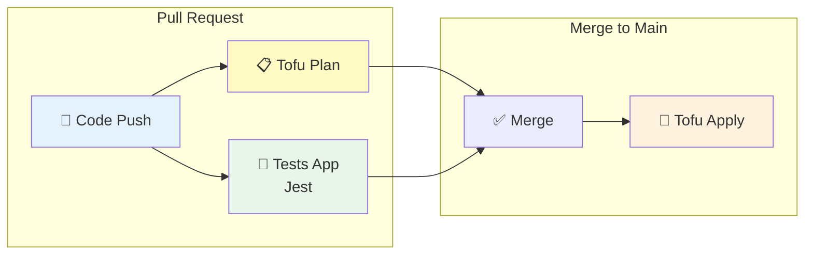
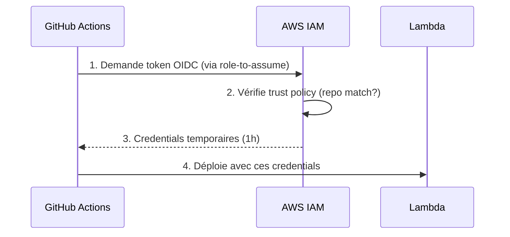

# TD5 - CI/CD avec GitHub Actions

## Introduction

Ce cinquième laboratoire met en place un pipeline **CI/CD complet** utilisant **GitHub Actions** pour automatiser les tests, la planification et le déploiement de l'infrastructure.

L'objectif est d'atteindre le "GitOps" : tout changement dans le code (application ou infrastructure) déclenche automatiquement les validations et déploiements appropriés.



---

## Étape 1 : Configuration OIDC (Sécurité)

Plutôt que de stocker des clés AWS dans GitHub Secrets (risqué), nous utilisons **OIDC** (OpenID Connect) pour que GitHub Actions puisse assumer temporairement un rôle IAM.

### Architecture OIDC



### Configuration Tofu (`ci-cd-permissions/main.tf`)

```hcl
provider "aws" {
  region = "us-east-2"
}

module "oidc_provider" {
  source       = "../../modules/github-aws-oidc"
  provider_url = "https://token.actions.githubusercontent.com" 
}

module "iam_roles" {
  source = "../../modules/gh-actions-iam-roles"

  name              = "lambda-sample"                           
  oidc_provider_arn = module.oidc_provider.oidc_provider_arn    

  # IMPORTANT: Remplacer par votre repo !
  github_repo      = "wilfried-lafaye/td-devops" 
  lambda_base_name = "lambda-sample"                            

  enable_iam_role_for_testing = true                            
  enable_iam_role_for_plan    = true                                
  enable_iam_role_for_apply   = true                                

  tofu_state_bucket         = "fundamentals-of-devops-tofu-state" 
  tofu_state_dynamodb_table = "fundamentals-of-devops-tofu-state" 
}
```

> [!IMPORTANT]
> Le `github_repo` doit correspondre **exactement** à votre repository sinon AWS refusera l'authentification.

> Le `github_repo` doit correspondre **exactement** à votre repository sinon AWS refusera l'authentification.

### Solutions des Exercices (Section 1)

**1. Pourquoi `id-token: write` ?**
Cette permission est *indispensable* pour que GitHub Actions puisse demander un token OIDC à AWS. Sans elle, l'étape `configure-aws-credentials` échouera.

**2. Restriction Trust Policy**
Dans le module `gh-actions-iam-roles`, la *Trust Policy* IAM vérifie strictement que le token vient du repo `github_repo`. C'est ce qui empêche un autre utilisateur GitHub d'utiliser votre rôle.

## Étape 2 : Workflow Tests Applicatifs

À chaque push, les tests Jest sont exécutés automatiquement.

### Workflow (`app-tests.yml`)

```yaml
name: Sample App Tests

on: push                                  

jobs:                                     
  sample_app_tests:                       
    name: "Run Tests Using Jest"
    runs-on: ubuntu-latest                
    steps:
      - uses: actions/checkout@v2         

      - name: Install dependencies        
        working-directory: td5/scripts/sample-app
        run: npm install

      - name: Run tests                   
        working-directory: td5/scripts/sample-app
        run: npm test
```

      - name: Run tests                   
        working-directory: td5/scripts/sample-app
        run: npm test

### Solutions des Exercices (Section 2)

**1. Faire échouer le pipeline**
Si vous modifiez `app.test.js` pour attendre "Mauvaise réponse", `npm test` renverra un code de sortie non-nul (exit code 1). GitHub Actions détectera cette erreur et arrêtera immédiatement le job, empêchant les étapes suivantes (déploiement) de s'exécuter.

## Étape 3 : Workflow Tofu Plan (sur PR)

Lorsqu'une Pull Request modifie l'infrastructure, un `tofu plan` est exécuté et le résultat est posté en commentaire.

### Workflow (`tofu-plan.yml`)

```yaml
name: Tofu Plan

on:
  pull_request:                                                             
    branches: ["main"]
    paths: ["td5/scripts/tofu/live/lambda-sample/**"]

jobs:
  plan:
    name: "Tofu Plan"
    runs-on: ubuntu-latest
    permissions:
      pull-requests: write                                                  
      id-token: write  # Requis pour OIDC !
      contents: read
    steps:
      - uses: actions/checkout@v2

      - uses: aws-actions/configure-aws-credentials@v3
        with:
          role-to-assume: arn:aws:iam::XXXXX:role/lambda-sample-plan 
          aws-region: us-east-2

      - uses: opentofu/setup-opentofu@v1

      - name: tofu plan                                                     
        id: plan
        working-directory: td5/scripts/tofu/live/lambda-sample
        run: |
          tofu init -no-color -input=false
          tofu plan -no-color -input=false -lock=false

      # Poste le résultat en commentaire sur la PR
      - uses: peter-evans/create-or-update-comment@v4                       
        with:
          issue-number: ${{ github.event.pull_request.number }}
          body: |
            ## ${{ steps.plan.outcome == 'success' && '✅' || '⚠️' }} `tofu plan` output
            ```${{ steps.plan.outputs.stdout }}```
```

---

## Étape 4 : Workflow Tofu Apply (sur Merge)

Lorsque la PR est mergée dans `main`, le `tofu apply` est exécuté automatiquement.

### Workflow (`tofu-apply.yml`)

```yaml
name: Tofu Apply

on:
  push:                                                                      
    branches: ["main"]
    paths: ["td5/scripts/tofu/live/lambda-sample/**"]

jobs:
  apply:
    name: "Tofu Apply"
    runs-on: ubuntu-latest
    permissions:
      pull-requests: write
      id-token: write
      contents: read
    steps:
      - uses: actions/checkout@v2

      - uses: aws-actions/configure-aws-credentials@v3
        with:
          role-to-assume: arn:aws:iam::XXXXX:role/lambda-sample-apply 
          aws-region: us-east-2

      - uses: opentofu/setup-opentofu@v1

      - name: tofu apply                                                     
        working-directory: td5/scripts/tofu/live/lambda-sample
        run: |
          tofu init -no-color -input=false
          tofu apply -no-color -input=false -lock-timeout=60m -auto-approve
```

          tofu apply -no-color -input=false -lock-timeout=60m -auto-approve
```

### Solutions des Exercices (Section 3 & 4)

**1. Séparation Plan / Apply**
Nous séparons ces deux étapes pour permettre une **revue humaine**. Le `plan` tourne sur la PR (avant merge) pour validation. Le `apply` ne tourne qu'une fois la PR validée et mergée sur `main`.

**2. Working Directory**
Il est crucial de définir `working-directory` car nos fichiers Tofu ne sont pas à la racine du repo.

---

## Étape 5 : Infrastructure Tests (Bonus)

En plus de tester l'application, nous pouvons tester l'infrastructure elle-même à chaque push.

### Workflow (`infra-tests.yml`)

```yaml
name: Infrastructure Tests
on: push
jobs:
  opentofu_test:
    runs-on: ubuntu-latest
    permissions:
      id-token: write
      contents: read
    steps:
      - uses: actions/checkout@v2
      - uses: aws-actions/configure-aws-credentials@v3
        with:
          role-to-assume: arn:aws:iam::XXXXX:role/lambda-sample-tests
          aws-region: us-east-2
      - uses: opentofu/setup-opentofu@v1
      - name: Tofu Test
        working-directory: td5/scripts/tofu/live/lambda-sample # Attention au chemin !
        run: |
          tofu init -backend=false -input=false
          tofu test -verbose
```

> [!WARNING]
> Dans le fichier fourni `infra-tests.yml`, le chemin était `ch5/...`. Il faut le corriger en `td5/...` pour qu'il corresponde à notre structure de projet !

## Feature Toggles

Le TD5 introduit également les **Feature Toggles** pour déployer du code sans l'activer immédiatement.

### Exemple (`sample-app-feature-toggle/app.js`)

```javascript
const express = require('express');
const app = express();

app.get('/', (req, res) => {
  if (lookupFeatureToggle(req, "HOME_PAGE_FLAVOR") === "v2") { 
    res.send(newFancyHomepage());  // Nouvelle version
  } else {
    res.send('Hello, World!');     // Version stable
  }
});

function lookupFeatureToggle(req, name) {
  return "v2";  // En prod: appel à un service de feature flags
}

function newFancyHomepage() {
  return 'Fundamentals of DevOps!';
}
```

> [!TIP]
> Les Feature Toggles permettent de déployer du code "éteint" en production, puis de l'activer progressivement (canary releases, A/B testing).

> Les Feature Toggles permettent de déployer du code "éteint" en production, puis de l'activer progressivement (canary releases, A/B testing).

### Solutions des Exercices (Section Feature Toggles)

**1. Implémentation du Toggle (`app.js`)**
```javascript
app.get('/', (req, res) => {
  // Simule un appel à un service externe (LaunchDarkly, AWS AppConfig...)
  if (lookupFeatureToggle(req, "HOME_PAGE_FLAVOR") === "v2") { 
    res.send('Fundamentals of DevOps!');
  } else {
    res.send('Hello, World!');
  }
});
```

**2. Test du Toggle (`app.test.js`)**
```javascript
test('Get / should return Fundamentals of DevOps!', async () => {
    const response = await request(app).get('/');
    expect(response.text).toBe('Fundamentals of DevOps!');
});
```

## 🔴 Problèmes rencontrés et Solutions

### 1. Échec du test unitaire

> **Problème** : Le test attendait "Hello, World!" mais l'app retournait "Fundamentals of DevOps!".

**Cause** : Le feature toggle était activé par défaut.  
**Solution** : Mettre à jour `app.test.js` pour attendre la nouvelle valeur.

---

### 2. Erreur de chemins dans GitHub Actions

> **Problème** : Les workflows cherchaient `ch5/...` au lieu de `td5/scripts/...`.

**Solution** : Mise à jour de tous les `working-directory` dans les fichiers YAML.

---

### 3. Absence du fournisseur OIDC

> **Erreur** : `No OpenIDConnect provider found`

**Cause** : Le module `ci-cd-permissions` n'avait pas été déployé.  
**Solution** :
```bash
cd td5/scripts/tofu/live/ci-cd-permissions
tofu init && tofu apply
```

---

### 4. Nom du repository incorrect dans l'OIDC

> **Erreur** : Le trust policy référençait un autre repo (`brikis98/...`).

**Solution** : Modifier `github_repo` dans `ci-cd-permissions/main.tf` :
```hcl
github_repo = "wilfried-lafaye/td-devops"  # Votre repo !
```

---

### 5. Permissions IAM insuffisantes

> **Erreurs** :
> - `AccessDeniedException: apigateway:POST`
> - `iam:PutRolePolicy not authorized`

**Solutions** :
1. Ajouter `apigateway:*` et `apigatewayv2:*` au module IAM.
2. Ajouter `iam:PutRolePolicy` et `iam:DeleteRolePolicy`.

---

## Conclusion

Ce TD5 conclut le parcours DevOps avec un pipeline CI/CD complet :

| Étape | Déclencheur | Action |
|-------|-------------|--------|
| Tests App | Chaque push | Jest vérifie le code |
| Tofu Plan | Pull Request | Prévisualisation des changements infra |
| Tofu Apply | Merge to main | Déploiement automatique |

Le tout sécurisé par **OIDC** (pas de clés statiques) et enrichi par les **Feature Toggles** pour des déploiements progressifs.

✅ **Félicitations !** Vous avez maintenant un pipeline DevOps professionnel.
