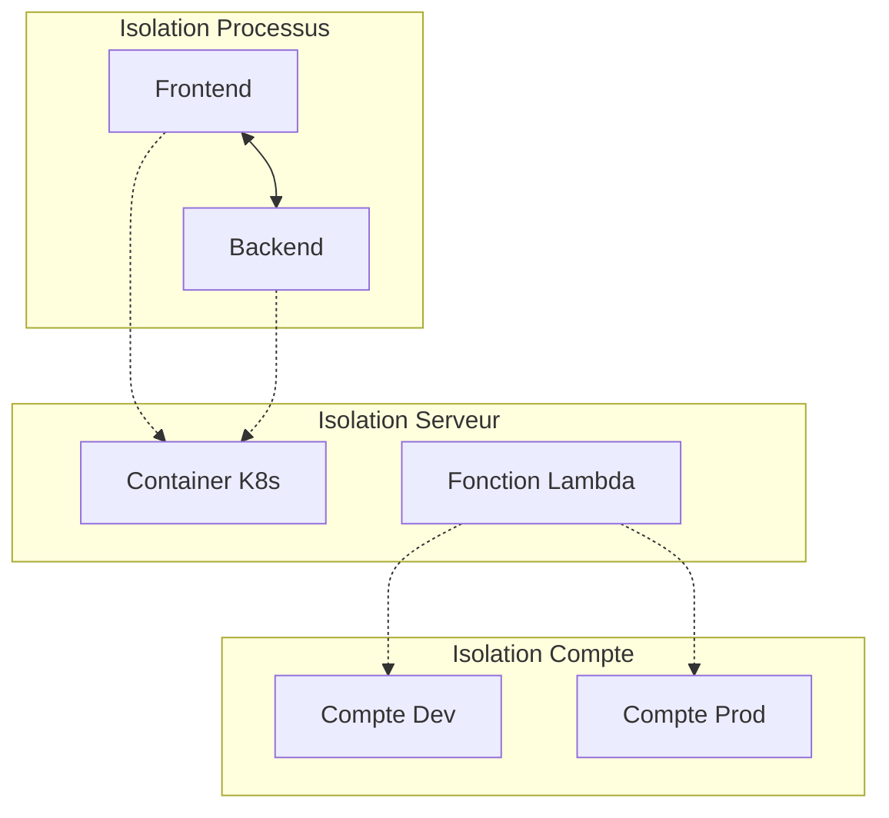

# TD6 - Isolation & Environnements

## Introduction

Ce sixième laboratoire explore les différentes stratégies d'**isolation** pour déployer des applications robustes et sécurisées. Nous passons d'une architecture monolithique à des microservices, et d'un compte AWS unique à une organisation multi-comptes.



---

## Étape 1 : Microservices (Isolation de Processus)

Nous découpons l'application en deux services distincts : un Frontend et un Backend.

### Architecture Frontend (`app.js`)

Le Frontend ne contient plus de logique métier, il appelle le Backend via HTTP.

```javascript
const backendHost = process.env.BACKEND_HOST || 'sample-app-backend-service';

app.get('/', async (req, res) => {
  // Appel au microservice Backend
  const response = await fetch(`http://${backendHost}`);
  const responseBody = await response.json();
  res.render('hello', { name: responseBody.text });
});
```

> [!NOTE]
> **Pourquoi une variable d'environnement ?**
> En local, `sample-app-backend-service` (nom DNS Kubernetes) n'existe pas. On utilise `BACKEND_HOST=localhost:3000` pour le développement et le nom du service K8s en production.

### Solutions des Exercices (Section 1)

**1. Code du Backend (`app.js`)**
Le backend est très simple, il retourne juste un JSON.
```javascript
const express = require('express');
const app = express();
app.get('/', (req, res) => {
  res.json({text: "backend microservice"});
});
module.exports = app;
```

**2. Test du Backend (`app.test.js`)**
```javascript
test('Get / should return backend microservice', async () => {
    const response = await request(app).get('/');
    expect(response.statusCode).toBe(200);
    expect(response.body.text).toBe('backend microservice'); 
});
```

---

## Étape 2 : AWS Organizations (Isolation de Compte)

Pour limiter le "Blast Radius" (rayon d'impact) d'un incident, nous utilisons **AWS Organizations** pour créer des comptes séparés pour chaque environnement.

### Configuration Tofu (`child-accounts/main.tf`)

```hcl
module "child_accounts" {
  source = "../../modules/aws-organization"

  create_organization = true

  dev_account_email   = "dev@example.com"
  stage_account_email = "stage@example.com"
  prod_account_email  = "prod@example.com"
}
```

> [!TIP]
> L'isolation par compte est la forme la plus forte de sécurité sur AWS. Elle garantit des limites strictes (quotas, facturation, accès) entre la Dev et la Prod.

### Solutions des Exercices (Section 2)

**1. Remplacer les emails**
Dans `child-accounts/main.tf`, vous devez mettre *vos* adresses emails (ou des alias `+dev`, `+prod`) pour que AWS puisse créer les comptes.
```hcl
dev_account_email   = "votre.email+dev@gmail.com"
stage_account_email = "votre.email+stage@gmail.com"
prod_account_email  = "votre.email+prod@gmail.com"
```

**2. `create_organization = false`**
Si vous avez déjà une organisation AWS, mettez `create_organization = false` pour importer les comptes existants au lieu de tenter d'en créer une nouvelle (ce qui échouerait).

---

## Étape 3 : Gestion de Configuration (Lambda)

Nous déployons une fonction Lambda qui change de comportement selon l'environnement (Workspace Tofu).

### Configuration Tofu (`lambda-sample-with-config/main.tf`)

```hcl
module "function" {
  # ...
  environment_variables = {
    NODE_ENV = "production"
    ENV_NAME = terraform.workspace # 'default', 'dev', ou 'prod'
  }
}
```

### Infrastructure Tests (`deploy.tftest.hcl`)

OpenTofu 1.6+ introduit une fonctionnalité de test native. Nous l'utilisons pour valider que le déploiement retourne bien le contenu attendu.

```hcl
run "validate" {
  command = apply

  module {
    source = "../../modules/test-endpoint"
  }

  assert {
    condition     = data.http.test_endpoint.status_code == 200
    error_message = "Unexpected status"
  }
}
```

### Solutions des Exercices (Section 3)

**1. Gestion des Workspaces**
OpenTofu utilise des "workspaces" pour gérer plusieurs états (state files) avec le même code.
```bash
tofu workspace new dev
tofu workspace new prod
tofu workspace select dev
```
La variable `terraform.workspace` dans le code HCL prendra automatiquement la valeur "dev" ou "prod".

**2. Chargement de la Config (`src/index.js`)**
La fonction Lambda charge la config dynamiquement :
```javascript
const envName = process.env.ENV_NAME || 'default';
const config = require(`./config/${envName}.json`);
```
C'est pourquoi il est crucial que le fichier JSON correspondant (ex: `default.json`) existe !

---

## 🔴 Problèmes rencontrés et Solutions

### 1. Résolution DNS (Frontend vs K8s)

> **Problème** : `fetch failed` lors des tests locaux car le nom DNS Kubernetes est introuvable.

**Solution** : Utiliser `process.env.BACKEND_HOST` pour rendre l'adresse configurable.
- K8s : `sample-app-backend-service`
- Local : `localhost:XXXX`

---

### 2. Modules OpenTofu Manquants

> **Erreur** : `subdir "ch3/tofu/modules/api-gateway" not found`

**Cause** : Les références pointaient vers un repo GitHub externe modifié.
**Solution** : Copier les modules `lambda` et `api-gateway` localement dans `td6/scripts/tofu/modules/` et utiliser des chemins relatifs (`../../modules/lambda`).

---

### 3. Conflit de noms IAM

> **Erreur** : `Role with name lambda-sample already exists`

**Solution** : Comme au TD4, utilisation de `random_pet` pour générer des noms uniques.

```hcl
resource "random_pet" "suffix" { ... }
name = "${var.name}-${random_pet.suffix.id}"
```

---

### 4. Échec de validation Tofu Test

> **Erreur** : `Unexpected body: Hello from default!` (Attendu: "Fundamentals of DevOps!")

**Cause** : Le code retournait le nom de l'environnement (`default`), mais le test attendait une chaîne statique obsolète.
**Solution** : Mise à jour du test pour correspondre à la réalité : `Hello from default!`.

---

### 5. Lambda Crash (Erreur 500)

> **Symptôme** : Erreur 500 récurrente.

**Cause** : Le code chargeait `./config/${ENV_NAME}.json`. En workspace `default`, il cherchait `default.json` qui n'existait pas.
**Solution** : Création du fichier `src/config/default.json`.

---

### 6. Timeout / DNS Propagation

> **Problème** : Les tests échouaient car l'API Gateway ou la Function URL n'étaient pas encore accessibles (propagation DNS).

**Solution** : Implémentation d'une **boucle d'attente active** dans le module de test (`null_resource` + `curl`) qui réessaie toutes les 5 secondes pendant 5 minutes avant de lancer la validation.

---

## Conclusion

Ce TD6 clôture la série en abordant les aspects architecturaux avancés :
- **Microservices** pour découpler les équipes et les déploiements.
- **Multi-comptes** pour sécuriser et isoler les environnements.
- **Configuration as Code** pour gérer la variabilité entre environnements.
- **Infrastructure Testing** pour valider le comportement du cloud avant la mise en production.

Vous disposez maintenant d'une vision complète du cycle de vie DevOps, du développement local (`docker`, `node`) à l'orchestration (`k8s`), l'IaC (`tofu`, `ansible`, `packer`) et l'automatisation (`github actions`).
